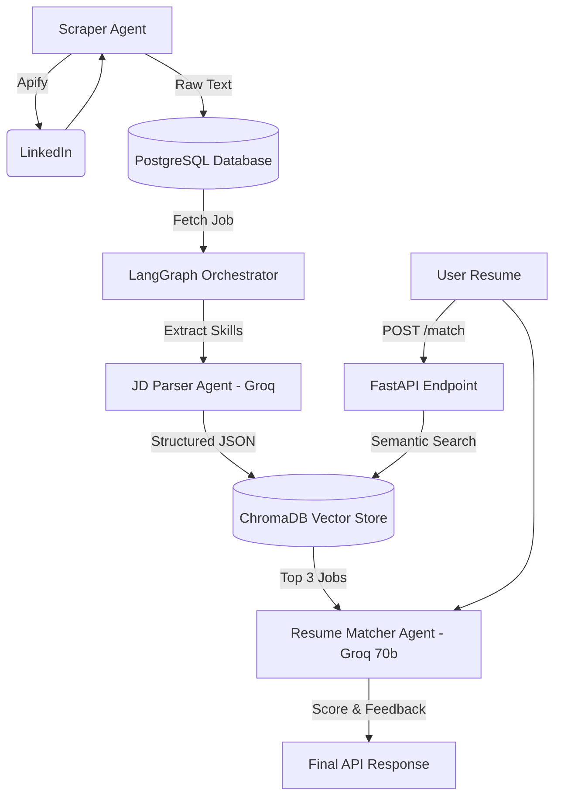

# JobPilot Architecture Review

Congratulations on completing the JobPilot pipeline! You've successfully built an end-to-end AI system that uses modern Agentic patterns. This is not just a toy project; it uses the exact same architecture patterns deployed by Silicon Valley AI startups today.

## System Architecture

## Core Components We Built

1. **The Ingestion Layer (Apify + Postgres)**
   Instead of using fake data, we built a Scraper Agent that hits Apify's API to bypass bot protection and grab real, messy LinkedIn job descriptions. We saved these into a Dockerized Postgres database for persistent storage.

2. **The Orchestration Layer (LangGraph)**
   We built a state machine assembly line. Instead of running scripts manually, LangGraph pulls the jobs out of Postgres and automatically hands them to our AI agents one by one.

3. **The Structured Extraction Layer (Groq + Pydantic)**
   LLMs love to chat, but we needed strict data. We used Pydantic to define an exact JSON schema (`ParsedJD`), and used the Groq `llama-3.1-8b` model to read messy paragraphs and extract the exact tech stack into perfect JSON.

4. **The Retrieval Layer (ChromaDB)**
   Running an LLM on 10,000 jobs is too slow and expensive. We used ChromaDB to turn our job descriptions into mathematical vectors. This allows us to do blazing-fast geometry (Semantic Search) to find the Top 3 jobs that match your resume *before* we wake up the expensive AI.

5. **The Reasoning Layer (Groq 70b)**
   Once we found the Top 3 jobs, we used the massive `llama-3.3-70b-versatile` reasoning model. This model acts as the Applicant Tracking System (ATS), cross-referencing your resume against the job requirements to give you a 0-100 score and tell you exactly what skills you are missing.

6. **The Web Layer (FastAPI)**
   We tied it all together into a standard web server so that any website or mobile app can interact with our AI backend via a simple `POST` request.

> [!TIP]
> **Resume Buzzwords Unlocked!** 
> By building this, you can confidently list the following on your resume/interviews: 
> *Retrieval-Augmented Generation (RAG)*, *Agentic Orchestration*, *Vector Databases*, *Semantic Search*, *LLM Structured Output*, and *Dockerized Microservices*.
